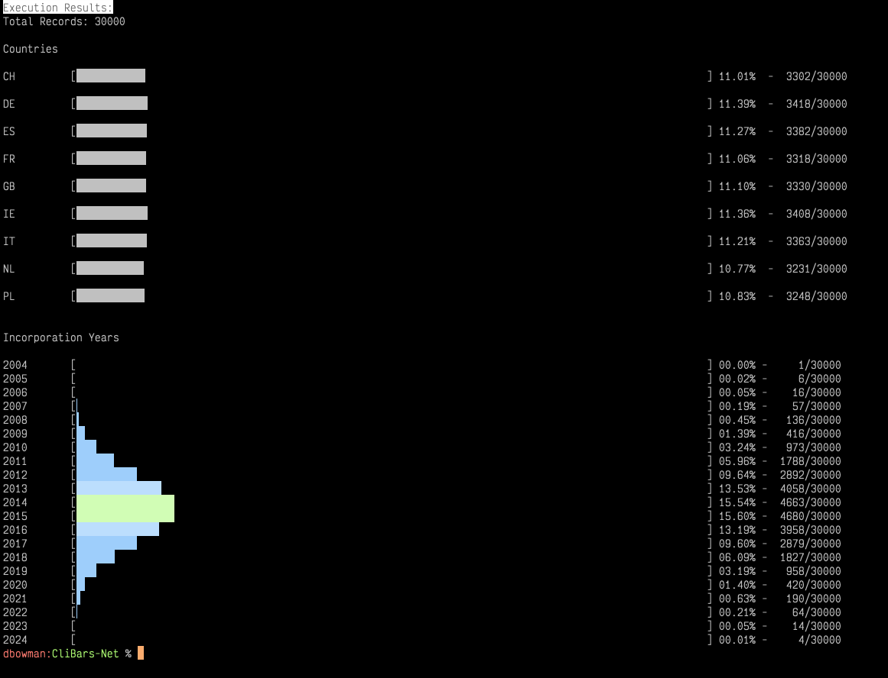
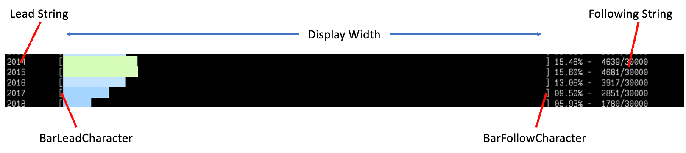

# Text Based Spinners

<div align="center">

A little package to create .NET CLI Barchart lines


</div>

---

This project holds a small .NET package that supports presenting a bar chart line on the command line.

[](https://opensource.org/licenses/MIT)

## Purpose of this Library

Small utilities and tools are frequently written using the command line as their user interface.
Often these tools need to present a range of results that can be easily compared. Rather than exporting the results to some external tool, or generating an image of the data for subsequent review, this code allows simple bar charts to be presented directly.

## The Bars

The generated bars have a number of elements that are configurable:



The body of the bar is created using standard unicode characters in the range `\u2589` to `\u258f`. You can find the array of characters that is used in the `BarLineGenerator` class.

The bar comprises solid blocks and a partial block relative to the value to give a nice clean style.

The boundary of the bar is set using the [Bar Delimiters](#bar-delimiters), and is then followed by the value, expressed as a percentage.

**Note** Depending on your terminal/command line setup, including the fonts you have chosen and the line spacing, you may find that the results aren't quite as clean as shown above. I've found inconsistencies for example between the MacOs internal terminal and iTerm2 terminal using the same font configuration - I'd be interested in hearing your experience.

### Bar Width

The `DisplayWidth` property sets the width of the actual bar, not the overall width of the displayed result. The `BarLineGenerator` class uses this width to determine the correct format for the generated bar.

### Bar Delimiters

The leading character for the bar and the following character for the bar default to `[` and `]`. These can be changed using the `BarLeadCharacter` and `BarFollowCharacter` properties. You can actually set this to any arbitrary string, or `String.Empty` if you prefer none.

### Lead Configuration

The lead string is configured with the `LeadStringFormat` property, and the `SetLeadData` method. This follows the standard .NET string formatting conventions.

### Following Configuration

The following string is configured with the `FollowingStringFormat` property, and the `SetFollowingData` method. This follows the standard .NET string formatting conventions.

## The Code

All of the barline code can be found in the `Barlines` folder. The 'BarLineFactory' class provides a convenience method for constructing either a colour or monochrome barline formatter.

```csharp
    var formatter = BarLineFactory.CreateBarLine(BarLineFactory.BarType.Colour);
    formatter.LeadStringFormat = "{0, -10} ";
    formatter.FollowingStringFormat = " - {0, 5}/{1}";
```

You have the option to specify your own colour scheme for the colour bar type, the setting is ignored for the default type.

In the above example, the lead string will be left aligned and padded to 10 characters, similarly the following format will require two values with the first right aligned and padded to 5 characters.

**Note** The bars, by default, will stack with no space. If you would prefer a gap between the bars then add a `\n` to the end of the `FollowingStringFormat` property.

With this code in place, it's just a matter of iterating over your dataset and making the appropriate calls to display the bars.

```csharp

    var ruleTotal = (float)results.Length;

    foreach (var d in dist)
    {
        var value = (float)d.Matches / ruleTotal;

        formatter.SetLeadData(d.Rule);
        formatter.SetFollowingData(d.Matches, ruleTotal);
        formatter.DisplayBar(value);
    }
```

For this example, which can be found in the `RecordDisplay.cs` file, has four phases to it:

1. Determine the total size of the data set
2. In each iteration, calculate the value as a proportion of the rules total.
3. Set the lead data to be the identifier for the bar, and the following data (in this example) to show the matches and count
4. Display the formatted bar

## Conclusions

I've used this code in a couple of CLI / Terminal / Bash based tools. It's  not  industrial strength, or even _production ready_ however you may interpret that phrase. But for simple displays, it works reasonably well.

Feel free to take it, adapt it and use it as you see fit. If you have feedback or comments, I'm always interested to hear at [david\@xorcon.ie](mailto:david@xorcon.ie)